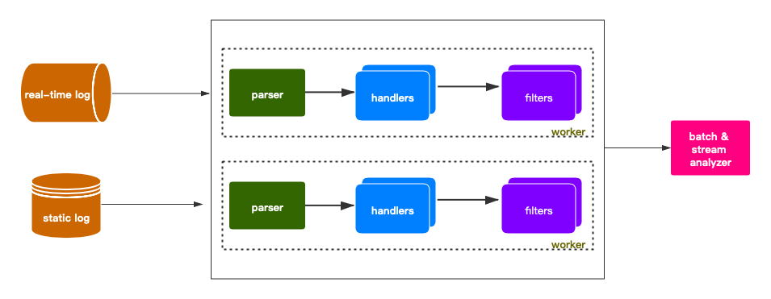

======================
Overview
======================

Architecture
--------------

DeepLog is lightweight and standalone log analysis engine over both bounded and unbounded log data. 

* process bounded & unbounded log data
  
  * **bounded data**， deep-log will process log data as bounded data by default, which mean there's definite end for log processing. in deep-log, current time is the end, further log change after deep-log start won't be processed.
  * **unbounded data**, deep-log can also monitor the further log changes for analysis, which means there's no define end for unbounded mode. 
  
* ETL processing
    deep-log has three steps to process data, parse, handle, filter. 

    * :ref:`parser <parser>`, parser is used to parse log data, which transfer unstructured data to structured data for further handlers.

    * **handlers**,handlers are used to data tranfer or clear which come from parser. for example, strip strings, data type convertion. 

    * **filter**, filters are used to data which is tranferred by handlers. 

* Analyze
    DeepLog print the processed item by default, but you can also do some anslysis on it

    * **batch & stream analysis**, DeepLog unified batch & streaming processing by specify different processing window size. streaming process can be treated batch processing with window size 1. if windows is not specified by user in command line, windows size will be chosen automatically by DeepLog. if it's a action can be processed as a stream, the windows size is 1, for example, print one line. of it's shuffle action, the window size will the max count of the records.
  
    *  **Pandas**, DeepLog expose a pandas DataFrame object named **df**, which can leverage pandas powerful operation to analyze data.

    * **OrderBy**, with order-by column, you can sort the processed records with user-specified column. 
    
    * **Distinct**, with this option, user can remove duplicated records by disctict keys. 

    * **format**, user can specific the output format by format options. 

